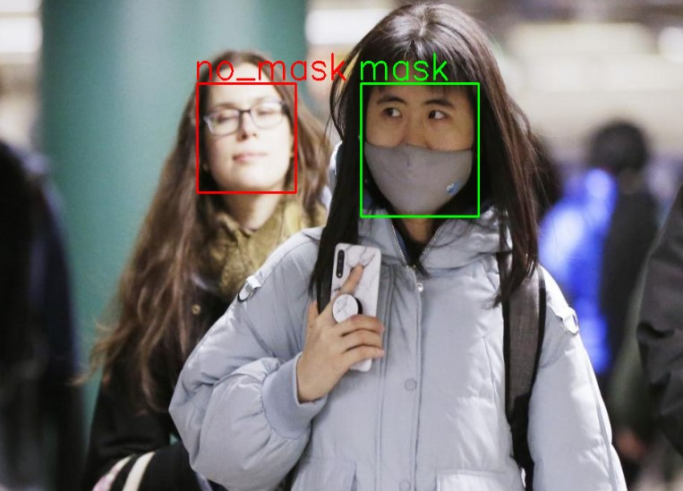
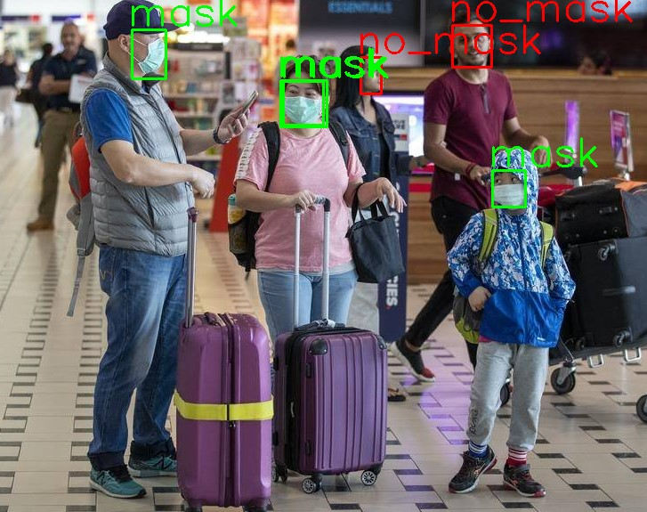

# YOLO Mask Detection System
## About
A system capable of detecting masks developed using YOLOv3 Darknet. This system can detect mask in image, video or in live webcam.

## Dataset Link:
[Kaggle Dataset](https://www.kaggle.com/datasets/aditya276/face-mask-dataset-yolo-format)

## Model Training File:
> yolov3-mask-detection-final.ipynb

## How to run?
1. Install Python 3.8.6 from [Python3.8](https://www.python.org/downloads/release/python-386/)

2. Install all requirements using:
```
pip install -r requirements.txt 
```
Better make a virtual environment before installing.  

3. Download the weight from this link: [YOLO Weights](https://drive.google.com/file/d/1DhDbirmjl3-NbTwV4dYCHkS-uUyKGrH2/view?usp=sharing)  

4. To detect in image:
```
py test_on_photo.py
```  

5. To detect in live video:
```
py test_on_live_video.py
```

## Outputs

### Detections in Image




### Detections in Video
[Detection Video](https://drive.google.com/file/d/13hKU4sMlngbBArOUJdZn660-p6dHr-D6/view?usp=sharing)

https://user-images.githubusercontent.com/43902648/182381056-4422118a-e2df-46e8-8820-ef2f0392c6f5.mp4

### Detections in Live Stream from Webcam 
https://user-images.githubusercontent.com/43902648/182382750-1fef669c-bc53-433e-b198-726b9dba64db.mp4

P.S: FPS was a bit low so detections were lagging in live video stream

### Acknowledgement
Special Thanks to [Siddhant Sharma](https://github.com/Siddhant128-bit), [Abhinandan Shrestha](https://github.com/abhinandanshrestha), [Nitess Kumar Das](https://github.com/Niteshkumardas)
